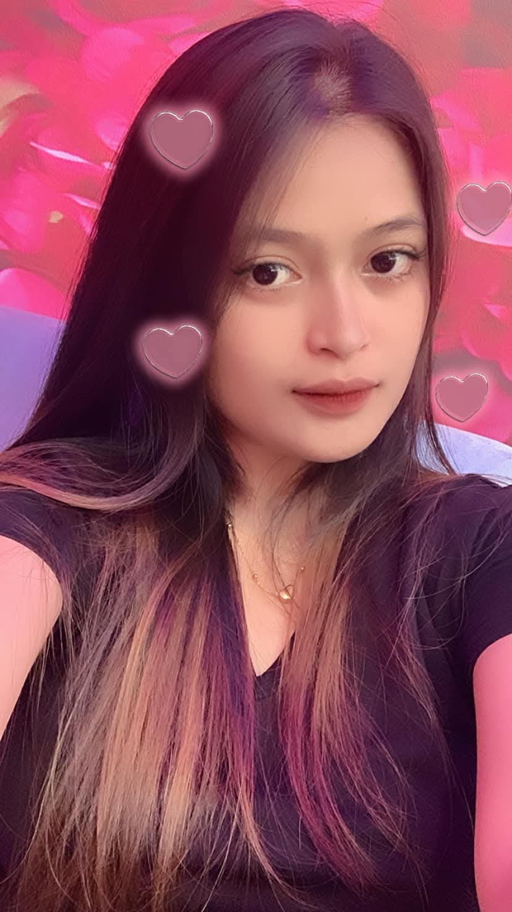

<html lang="en">
<head>
    <meta charset="UTF-8">
    <meta name="viewport" content="width=device-width, initial-scale=1.0">
    <title>Halo Oca, Ex!</title>
    <link rel="stylesheet" href="https://cdnjs.cloudflare.com/ajax/libs/font-awesome/6.0.0-beta3/css/all.min.css">
    
</head>
<body>
    <!-- Flower Animation -->
    

    

    

    

    

    

    

    

    <!-- Background Music -->
    <audio id="background-music" loop>
        <source src="audio1.mp3" type="audio/mp3">
        Your browser does not support the audio element.
    </audio>

    

        
Halo Monicandra Puspitasari!

        
Kasih masukki namata yang saya panggil biar bisaki lanjut:

        <input type="text" id="userName" placeholder="*Panggilanku Untuk Kita" style="padding: 10px; font-size: 1.2em; border-radius: 5px; border: 1px solid #ddd; width: calc(100% - 24px); box-sizing: border-box;">
        <button class="start-btn" onclick="startExperience()">lanjutki</button>
    

    

        

            
Halo Oca !

            

                heheh Aneh toh ada yang dekatiki orang seperti saya wkwkw, tapi nda bercandaka untuk dekatiki ini, mungki nda terbiasaki dengan orang seperti saya hehe nda tauka mau buatkan ki cuma iniji saya bisa buatkan ki.
            

            
❤️

            

                
            

            
With all my hopes, Andi Irfan Maulana

            <button class="next-btn" onclick="nextSlide(1)">Next</button>
        

        

            
Harapan

            

              nda banyak harapanku dari kita, dan nda bisaka banyak janji dengan kita harapanku cukup bisaka dengan kita sesuai dengan niatku, dan nda bisaka janji banyak kekita dan ke king tapi saya usahakan untuk kita dan king.
            

            
💖

            

                
            

            
Forever yours, Monicandra Puspitasari

            <button class="next-btn" onclick="nextSlide(2)">Next</button>
        

        

            
Selalu Dihati

            

                Meskipun kita mungkin anehki dan belum bisaki sama - sama dengan saya, tapi jujur dari awal saya dmki ditiktok punya ka perasaan dengan kita yang mana itu perasaan sudah lama mka nda rasaki tapi nda saya paksaki untuk bisaki sama tapi tujuanku dan harapanku bisaki sama -  sama walaupun mungin aneh karna bemum pernahki ketemu 
            

            
💞

            

                
            

          
        <button class="send-btn" onclick="sendGiftRequest()">Jawabanta heheh</button>
    

    
</body>
</html>
`
